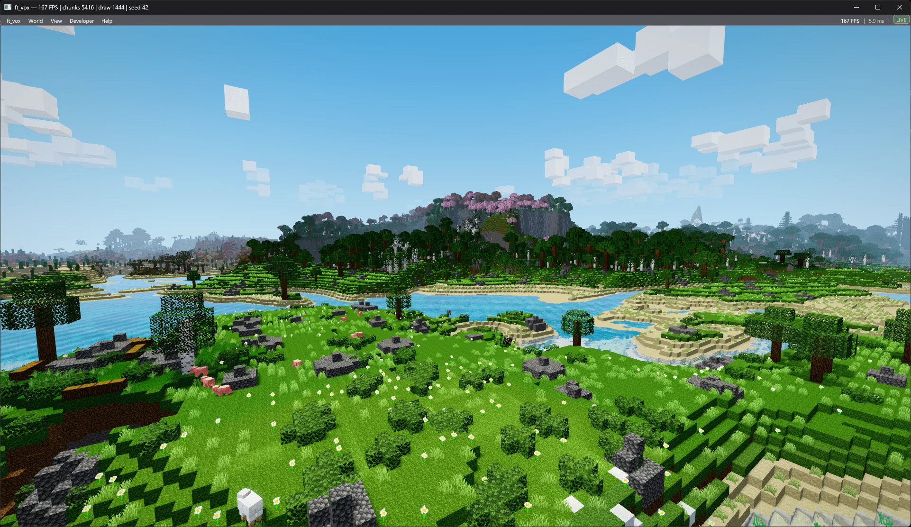
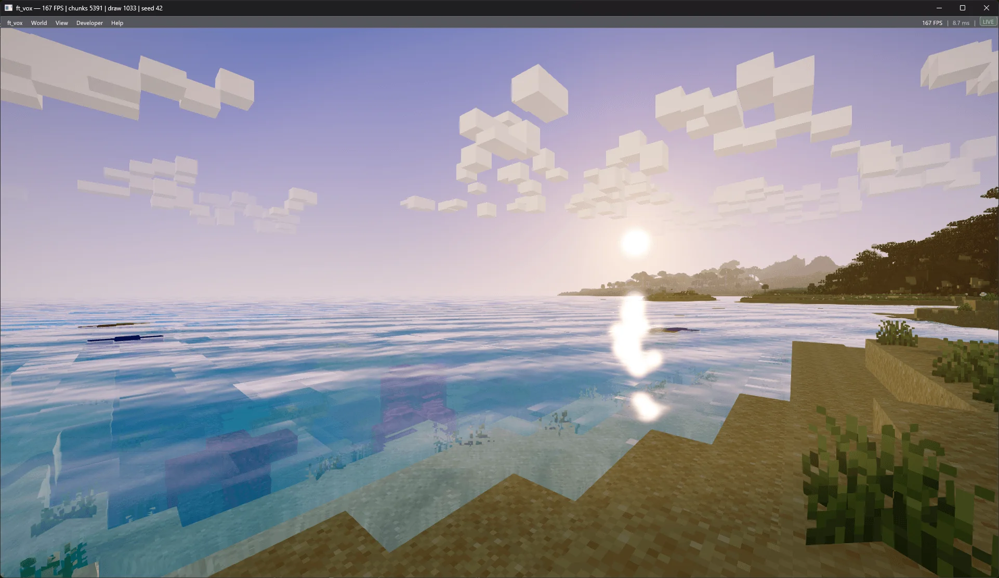
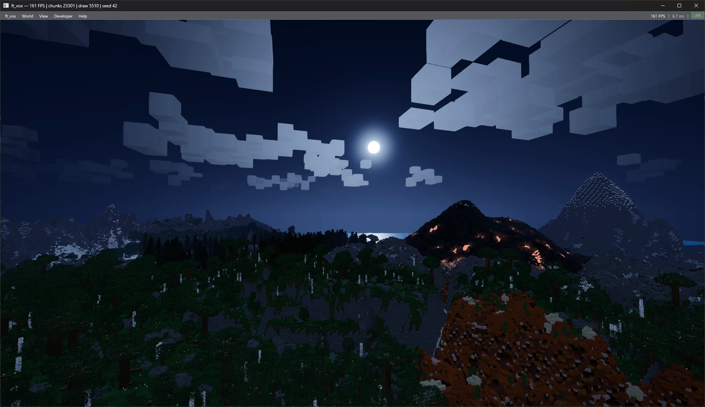
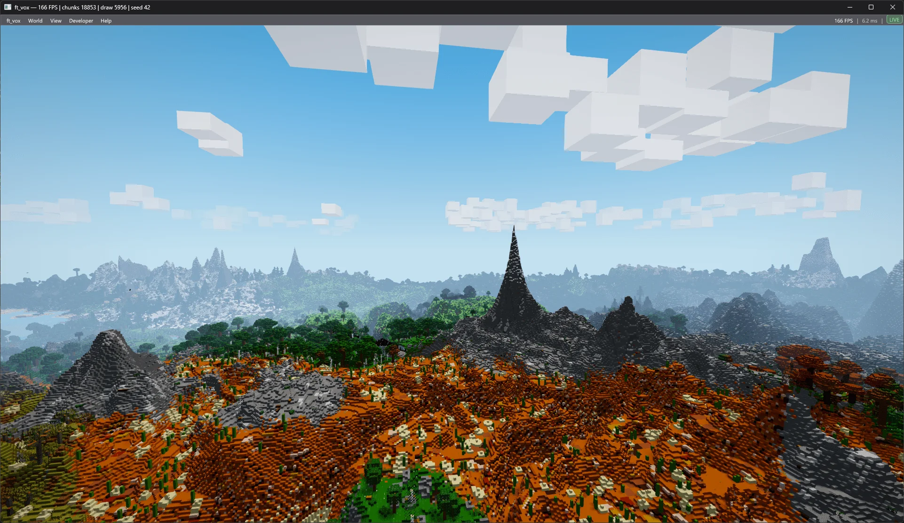
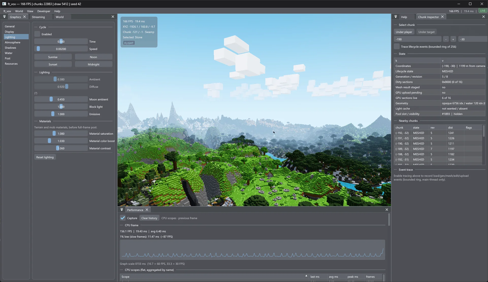

# ft_vox

Cross-platform voxel sandbox engine built from scratch in **C++20**, **Vulkan** and **SDL3**.

<p align="center">
  
</p>


ft_vox is a voxel sandbox engine focused on real-time rendering, procedural
terrain generation and engine architecture.

It features infinite terrain, biome generation, player physics, dynamic
lighting, water, HDR post-processing, passive wildlife, persistent world
saves, profiling and automated visual-regression testing.

## Features

### World
- Infinite procedural terrain with biomes, caves and rivers
- Distance-based chunk streaming with LOD meshing
- Persistent world saves for voxel edits and world state
- Resource-pack support for block textures

### Rendering
- Vulkan 1.2 renderer with dedicated shadow, opaque, water, sky and post passes
- Dynamic cascade shadows with PCF filtering
- HDR post stack: bloom, god rays, ACES tonemapping, optional FXAA
- Full day/night cycle

### Engine
- Player controller on a shared voxel collision solver
- Passive wildlife (cow, pig, sheep, chicken) with ambient wander AI
- ImGui tooling: graphics, streaming, world map and chunk inspector panels
- CPU workload telemetry and GPU frame profiling
- Automated offscreen visual-regression tests

## Screenshots

| Sunset | Night |
|--------|-------|
|  |  |

**Long render distance**



## Technical highlights

ft_vox is also an experimentation ground for modern C++ and real-time
graphics engineering.

- Modular Vulkan renderer with an explicit pass graph
- GPU memory management with VMA; texture arrays and greedy meshing
- Asynchronous chunk streaming: thread-pool generation and meshing, staged uploads
- Procedural terrain generation with FastNoise2 noise and biome graphs
- One voxel collision solver shared by the player, mobs and tooling
- CPU workload telemetry (`FT_VOX_TELEMETRY`) and GPU timestamp profiling
- Automated offscreen visual-regression harness with golden references
- Cross-platform dependency management: vcpkg, system packages and FetchContent



## Quick start

### Linux

```bash
./install_dep.sh
make
./build-vk/ft_vox
```

### Windows

```powershell
.\build.ps1
.\build\Release\ft_vox.exe
```

### macOS

```bash
./install_dep.sh
export VK_ICD_FILENAMES=/opt/homebrew/etc/vulkan/icd.d/MoltenVK_icd.json
make
./build-vk/ft_vox
```

For complete build instructions and dependency configuration, see
[Building ft_vox](docs/building.md).

## Controls

| Input | Action |
|-------|--------|
| WASD / mouse | Move / look |
| Space / Shift | Jump / sprint (up / down while swimming or flying) |
| LMB / RMB | Break / place block |
| T | Cycle selected block |
| V | Toggle walking / debug flight |
| B | Toggle chunk borders |
| Esc | Release mouse |

Flight boost, swimming and all movement modes are detailed in
[player-physics.md](docs/player-physics.md).

## Documentation

Detailed technical documentation lives under [`docs/`](docs/):

- [Engine architecture](docs/engine-architecture.md)
- [Vulkan renderer](docs/vulkan-graphics.md)
- [Terrain generation](docs/terrain-generation.md)
- [Player physics](docs/player-physics.md)
- [GPU profiling](docs/gpu-profiling.md)
- [Visual regression](docs/visual-regression.md)
- [Workload telemetry](docs/workload-telemetry.md)
- [Building ft_vox](docs/building.md)

## Project status

ft_vox is under active development. The core rendering, terrain, physics and
tooling systems are functional, but APIs, gameplay systems and asset formats
may still change.

An experimental UDP networking prototype lives under `src/Network/`; it is
compiled into `test_network` only and is not part of the game.

## License

No project license file is currently provided.
See [THIRD_PARTY_NOTICES.md](THIRD_PARTY_NOTICES.md) for third-party components.
